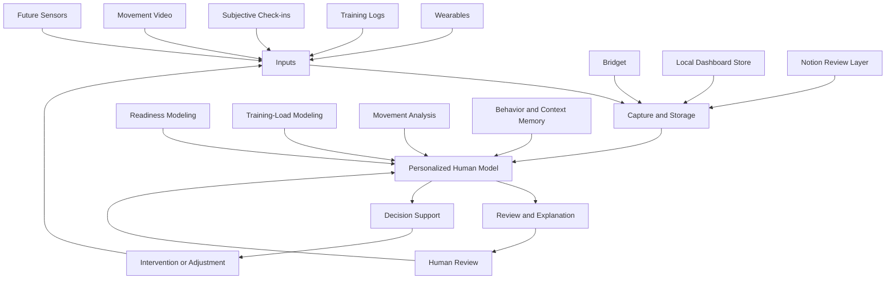

# The Human Model

The Human Model is a public research and product repository for building personalized computational models of recovery, training, movement, behavior, and response to intervention.

The project starts from a simple product thesis: the product is not the watch, chatbot, dashboard, or individual model. The product is the personalized human model underneath them.

Portfolio page: [The Human Model](https://hallowed-seat-b6b.notion.site/The-Human-Model-382cf4d8ba1880a188dbc6a664b5a7cc)

## The Problem

Most health and performance tools are good at collecting data and weak at turning it into decisions. Wearables can report sleep, HRV, activity, and resting heart rate. Training apps can store workouts. Dashboards can visualize trends. Chatbots can ask questions. But the user is still left doing the hardest work: deciding which signal matters, whether it applies today, and what should actually change.

That gap matters because the useful question is rarely "what happened?" It is "what does this mean for this person, in this context, right now?"

The Human Model explores that layer. It treats recovery signals, training history, subjective context, movement quality, and feedback loops as evidence for a living model of one human system.

## Core Thesis

The durable product is a personalized model that learns how a person responds.

Interfaces are delivery surfaces. Bridget can ask for context or send a morning card. A dashboard can expose audit trails and weekly review. A readiness model can make a cautious training call. A movement-analysis pipeline can flag a rep pattern. None of those surfaces is the whole product.

The center is the model underneath them: a transparent, local-first, reviewable system that connects inputs, uncertainty, decisions, and outcomes over time.

## Why Bodybuilding Is The First Test Environment

Bodybuilding is a useful first test environment because it creates repeated, measurable, high-feedback cycles:

- training sessions with exercises, sets, reps, loads, and qualitative notes
- recovery constraints that affect performance and adherence
- movement patterns that can be compared across sessions
- visible consequences when fatigue, stress, or poor execution accumulates
- enough structure to model, but enough messiness to keep the system honest

This is not because bodybuilding is the final market. It is because it makes the modeling problem concrete. The same underlying questions show up in sports performance, rehabilitation, physical therapy, assistive technology, chronic-condition management, and human-machine interaction.

## What Works Today

The project is early-stage and actively evolving, but several working loops exist today across the private implementation repositories and this public demonstration layer.

Implemented:

- Apple Health recovery import for sleep, HRV, resting heart rate, weight, workout duration, workout type, and active energy.
- Telegram-based Bridget workflows for recovery check-ins, morning context, workout logging, daily cards, calibration, and low-friction corrections.
- A local Coach Dashboard backed by SQLite for recovery, training, body, signal health, weekly review, readiness, and movement-quality review.
- Transparent readiness modeling that produces auditable push/maintain/modify/rest calls instead of hiding decisions inside an LLM.
- Training-load modeling that creates guarded next-session recommendations and keeps model/debug output separate from editable workout notes.
- A local MediaPipe RDL movement-analysis prototype with rep metrics, annotated playback, angle trends, and review flags.
- Public-safe examples in this repository using mock data instead of private health records, Notion IDs, or local secrets.

Experimental:

- Multi-angle movement review, where camera views are preserved as separate observations instead of averaged into invalid metrics.
- Shared media-ingestion boundaries for future desktop drops, Apple Shortcuts, Bridget uploads, and manual review queues.
- Dashboard V2-style training/session summaries and planned-vs-actual review loops.

Future:

- Stronger calibration against outcomes.
- Broader sensing beyond commodity wearable data.
- More general movement-quality modeling.
- Intervention testing where recommendations can be evaluated against actual behavior and response.

## High-Level System Architecture

The architecture is intentionally modular. Bridget is the daily conversational surface. The dashboard is the deeper review and audit surface. Readiness modeling, training-load modeling, and movement analysis are separate reasoning layers. The public repository is the narrative and demonstration layer for the system as a whole.

## Current Prototypes And Demos

This repository includes sanitized, runnable examples extracted from the working system:

- [Readiness scoring demo](examples/readiness_scoring_demo.py)
- [Readiness modeling demo](examples/readiness_modeling_demo.py)
- [Bridget prompt demo](examples/bridget_prompt_demo.py)
- [Daily card demo](examples/daily_card_demo.py)
- [Dashboard data-shaping demo](examples/dashboard_data_shaping_demo.py)
- [Movement-quality demo](examples/movement_quality_demo.py)
- [Training prediction sheet demo](examples/training_prediction_sheet_demo.py)
- [Media ingestion router demo](examples/media_ingestion_router_demo.py)

The examples use mock data and are designed to run without private Notion databases, personal health records, Telegram tokens, or local automation paths. See [examples/README.md](examples/README.md) for run instructions.

Demo asset:

- [MediaPipe RDL form demo](demo/mediapipe-rdl-form/) shows an early local RDL movement-analysis prototype with pose overlay and charted movement signal.

## Principles And Safeguards

- Local-first where possible: private health and training data stays in local files, local databases, or private Notion workspaces.
- Transparent modeling: baseline models should expose inputs, confidence, missing data, and limiting factors.
- Human review before automation: recommendations are treated as decision support, not autonomous coaching.
- Public/private separation: this repository can explain architecture and demos without exposing personal records or secrets.
- Honest status labels: implemented, experimental, and future work should stay clearly separated.
- Low-friction capture: Bridget exists because the model improves only if the system can learn from real life without forcing long forms.

## Broader Research Direction

The long-term research direction is a personal model that can connect data acquisition, interpretation, decision support, and intervention testing. Recovery and training are the current proving ground, but the broader question is how software can represent an individual human system well enough to support better decisions.

That makes this project partly engineering, partly product research, partly applied modeling, and partly human-computer interaction. The near-term work is deliberately narrow: keep the loops reliable, keep the claims modest, and make every model output inspectable.

## Technical Documentation And Implementation Repositories

This public repository now lives at `haleyparks329/the-human-model`.

- Foundation implementation repository: [haleyparks329/human-model](https://github.com/haleyparks329/human-model)
- Bridget/chatbot implementation repository: [haleyparks329/human-model-chatbot](https://github.com/haleyparks329/human-model-chatbot)
- Public repository: [haleyparks329/the-human-model](https://github.com/haleyparks329/the-human-model)

Technical docs:

- [Architecture](docs/architecture.md)
- [Implementation Progress](docs/implementation-progress.md)
- [Coach Dashboard V1](docs/coach-dashboard-v1.md)
- [Telegram Chatbot Evolution](docs/chatbot-telegram-evolution.md)
- [Recovery Modeling](docs/recovery-modeling.md)
- [Movement Analysis](docs/movement-analysis.md)
- [Roadmap](docs/roadmap.md)
- [Vision](docs/vision.md)
- [Research Notes](docs/research-notes.md)
- [Source Context](docs/source-context.md)
- [Project Log Automation](docs/project-log-automation.md)
- [Documentation Cleanup Notes](docs/documentation-cleanup-notes.md)
