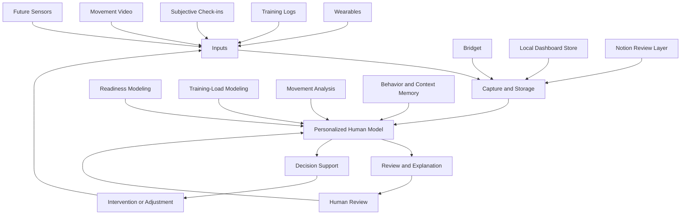

# The Human Model

The Human Model is a long-term research and engineering project exploring how software can build personalized computational models of recovery, training, movement, behavior, and response to intervention. This repository is the public home for that work.

The project starts from a simple thesis: the product is not the watch, chatbot, dashboard, or individual model. The product is the personalized human model underneath them.

I started this project because most software is very good at modeling workflows, records, and transactions, but much worse at representing people. I wanted to understand how recovery, training, movement, behavior, context, and intervention interact over time instead of leaving those signals trapped in separate apps. Bodybuilding became the first research environment because it creates repeated, measurable feedback: I can change something, observe the result, and gradually make the model less generic.

Portfolio page: [The Human Model](https://hallowed-seat-b6b.notion.site/The-Human-Model-382cf4d8ba1880a188dbc6a664b5a7cc)

## The Problem

Modern software is very good at recording events. It is much worse at representing people.

Most systems store what happened: a workout was logged, a sleep score changed, a check-in was submitted, a dashboard row was updated. That matters. Records are necessary. But the important context often lives between the records: what changed, why it changed, whether it mattered, and how it relates to the same person over time.

Health and performance tools make this especially visible. Data is fragmented across wearables, workout apps, notes, dashboards, photos, chats, and subjective memory. Each tool sees a slice. I am the integration layer, which means the most important context lives in my memory and attention. The problem is that the user is still left to reconstruct the whole picture manually, deciding which signal matters, whether it applies today, and what should actually change.

The deeper problem is not limited to fitness. A lot of software stores events without learning what matters for this person. It can preserve a timeline without building a model.

The Human Model explores that missing layer. It treats recovery signals, training history, subjective context, movement quality, and feedback loops as evidence for a living model of one human system.

## Core Thesis

The durable product is a personalized model that learns how a person responds.

Interfaces are delivery surfaces. Bridget can ask for context or send a morning card. A dashboard can expose audit trails and weekly review. A readiness model can make a cautious training call. A movement-analysis pipeline can flag a rep pattern. None of those surfaces is the whole product.

The center is the model underneath them: a transparent, local-first, reviewable system that connects inputs, uncertainty, decisions, and outcomes over time.

## Why Bodybuilding Is The First Test Environment

Bodybuilding is useful not only because it is measurable, but because it creates repeated interventions and feedback loops.

It allows deliberate changes to variables such as:

- calories and nutrition
- training load and volume
- exercise selection
- sleep and recovery behavior
- movement execution
- fatigue management

Those interventions create outcomes that can be observed over time. A training block changes. Recovery changes. Execution changes. Energy, adherence, soreness, and performance change. The system can begin to ask better questions because the environment produces repeated cycles of action and response.

This is not because bodybuilding is the final market. It is because it makes the modeling problem concrete. The same underlying questions show up in sports performance, rehabilitation, physical therapy, assistive technology, chronic-condition support, education, careers, and personal computing.

## What Works Today

The project is early-stage and actively evolving, but several working loops exist today across the private implementation repositories and this public demonstration layer.

Implemented:

- Apple Health recovery import for sleep, HRV, resting heart rate, weight, workout duration, workout type, and active energy.
- Telegram-based Bridget workflows for recovery check-ins, morning context, workout logging, daily cards, calibration, and low-friction corrections.
- A local Coach Dashboard backed by SQLite for recovery, training, body, signal health, weekly review, readiness, and movement-quality review.
- Transparent readiness modeling that produces auditable push/maintain/modify/rest calls instead of hiding decisions inside an LLM.
- Training-load modeling that creates guarded next-session recommendations and keeps model/debug output separate from editable workout notes.
- A local MediaPipe RDL movement-analysis prototype with rep metrics, annotated playback, angle trends, and review flags.
- Public-safe examples in this repository using mock data instead of private health records, Notion IDs, or local secrets.

Experimental:

- Multi-angle movement review, where camera views are preserved as separate observations instead of averaged into invalid metrics.
- Shared media-ingestion boundaries for future desktop drops, Apple Shortcuts, Bridget uploads, and manual review queues.
- Dashboard V2-style training/session summaries and planned-vs-actual review loops.

Future:

- Stronger calibration against outcomes.
- Broader sensing beyond commodity wearable data.
- More general movement-quality modeling.
- Intervention testing where recommendations can be evaluated against actual behavior and response.

## High-Level System Architecture

The architecture is intentionally modular. Bridget is the daily conversational surface. The dashboard is the deeper review and audit surface. Readiness modeling, training-load modeling, and movement analysis are separate reasoning layers. The public repository is the narrative and demonstration layer for the system as a whole.

## Current Prototypes And Demos

This repository includes sanitized, runnable examples extracted from the working system:

- [Readiness scoring demo](examples/readiness_scoring_demo.py)
- [Readiness modeling demo](examples/readiness_modeling_demo.py)
- [Bridget prompt demo](examples/bridget_prompt_demo.py)
- [Daily card demo](examples/daily_card_demo.py)
- [Dashboard data-shaping demo](examples/dashboard_data_shaping_demo.py)
- [Movement-quality demo](examples/movement_quality_demo.py)
- [Training prediction sheet demo](examples/training_prediction_sheet_demo.py)
- [Media ingestion router demo](examples/media_ingestion_router_demo.py)

The examples use mock data and are designed to run without private Notion databases, personal health records, Telegram tokens, or local automation paths. See [examples/README.md](examples/README.md) for run instructions.

Demo asset:

- [MediaPipe RDL form demo](demo/mediapipe-rdl-form/) shows an early local RDL movement-analysis prototype with pose overlay and charted movement signal.

## Principles And Safeguards

- Model first: interfaces, dashboards, chatbots, and reports should serve the underlying personalized model.
- Transparent evidence and uncertainty: model outputs should show inputs, confidence, missing data, and unsupported cases.
- Human review: recommendations are decision support, with review and override before stronger automation.
- Local-first and user-owned where possible: private health data, memory, and model context should stay under personal control.
- Low-friction capture: the system should learn from real life without demanding long forms or repetitive manual work.
- Honest status boundaries: implemented, experimental, and future work should stay clearly separated.

See [Design Principles](docs/design-principles.md) for the full product and engineering principles.

## Broader Research Direction

The long-term research direction is a personal model that can connect data acquisition, interpretation, decision support, and intervention testing. Recovery and training are the current proving ground, but the broader question is how software can represent an individual human system well enough to support better decisions.

That makes this project partly engineering, partly product research, partly applied modeling, and partly human-computer interaction. The near-term work is deliberately narrow: keep the loops reliable, keep the claims modest, and make every model output inspectable.

## Technical Documentation And Implementation Repositories

Public repository: [haleyparks329/the-human-model](https://github.com/haleyparks329/the-human-model)

- Foundation implementation repository: [haleyparks329/human-model](https://github.com/haleyparks329/human-model)
- Bridget/chatbot implementation repository: [haleyparks329/human-model-chatbot](https://github.com/haleyparks329/human-model-chatbot)

Technical docs:

- [Why The Human Model](docs/why-the-human-model.md)
- [Philosophy](docs/philosophy.md)
- [Design Principles](docs/design-principles.md)
- [Architecture](docs/architecture.md)
- [Implementation Progress](docs/implementation-progress.md)
- [Coach Dashboard V1](docs/coach-dashboard-v1.md)
- [Telegram Chatbot Evolution](docs/chatbot-telegram-evolution.md)
- [Recovery Modeling](docs/recovery-modeling.md)
- [Movement Analysis](docs/movement-analysis.md)
- [Roadmap](docs/roadmap.md)
- [Vision](docs/vision.md)
- [Research Notes](docs/research-notes.md)
- [Source Context](docs/source-context.md)
- [Project Log Automation](docs/project-log-automation.md)
- [Documentation Cleanup Notes](docs/documentation-cleanup-notes.md)
