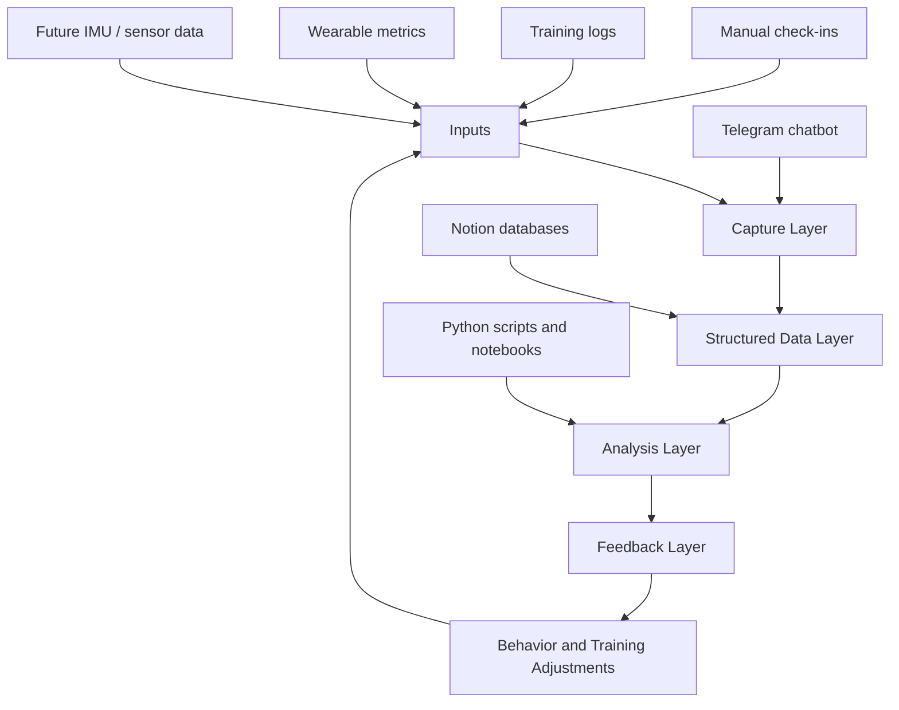

# Architecture

The Human Model is organized as a layered system.



## Repository Roles

### `human-model`

The foundation repo defines the project structure and source-of-truth documentation.

It is responsible for:

- Tracking schemas
- Data contracts
- Weekly review workflows
- Experiment design
- Research notes
- Future notebooks, dashboards, and hardware notes

### `human-model-chatbot`

The chatbot repo is the interface and automation layer.

It is responsible for:

- Accepting natural-language inputs
- Calling a local LLM through Ollama
- Returning useful coaching-style responses
- Parsing structured check-ins
- Sending future entries to Notion or another data store

## Current Technical Stack

- Python
- Telegram bot API
- Ollama running a local model
- Notion as the early knowledge and database layer
- GitHub issues for sprint planning
- Future analytics stack: pandas, NumPy, matplotlib, Plotly, scikit-learn, Jupyter, Streamlit
- Future sensing stack: Arduino, IMU sensors, force sensors, possible EMG experiments

## First Closed Loop

The first meaningful system loop is Recovery Tracking V1:

```text
natural-language check-in
-> parsed recovery fields
-> Notion recovery entry
-> weekly review
-> next training / recovery adjustment
```

This gives the project a working data spine before adding more advanced modeling or hardware.

