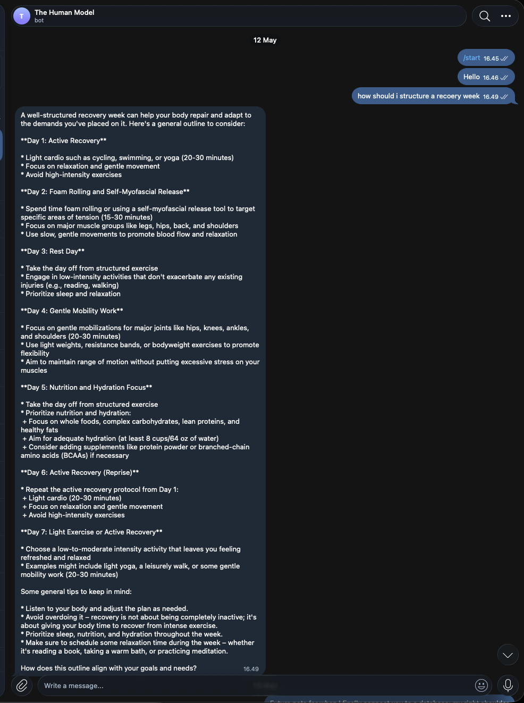
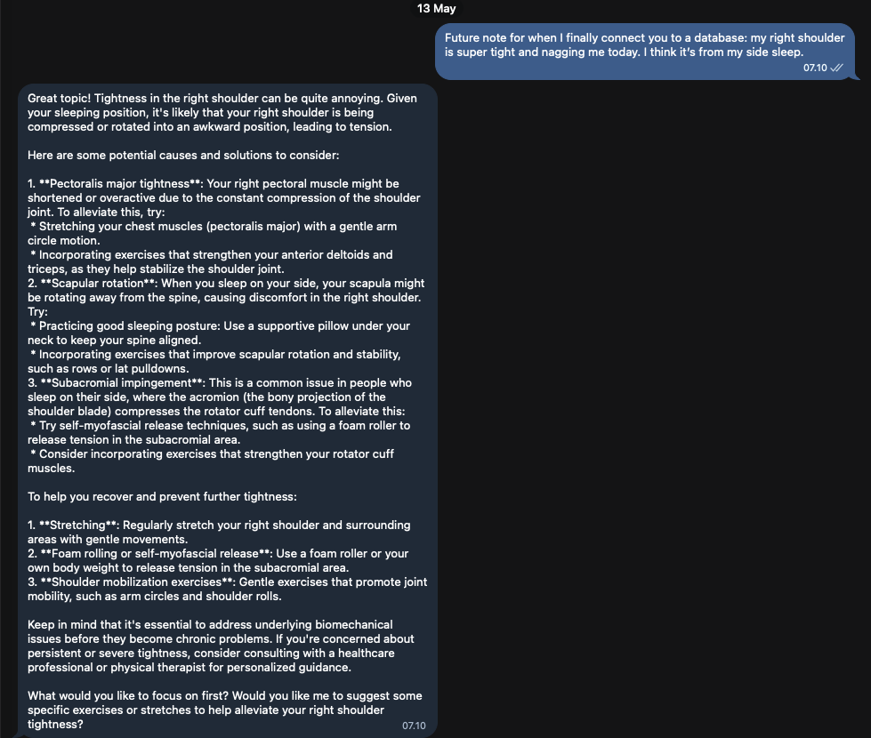
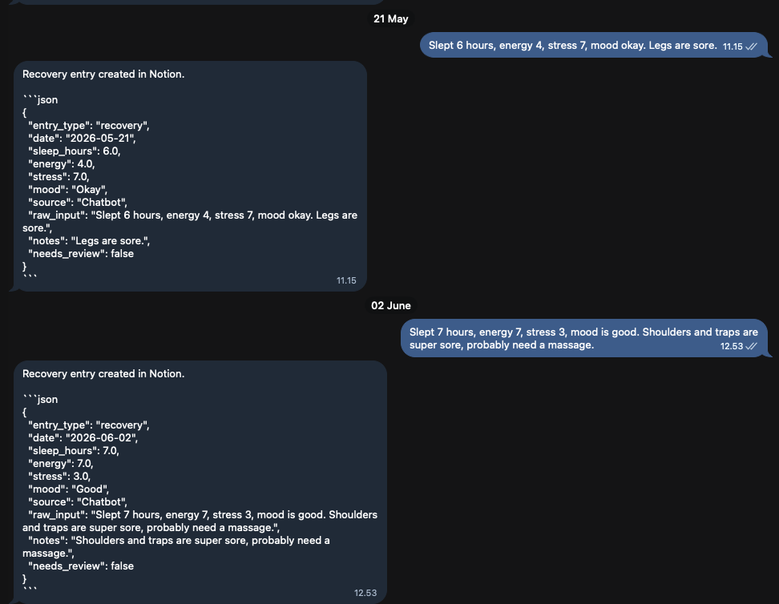
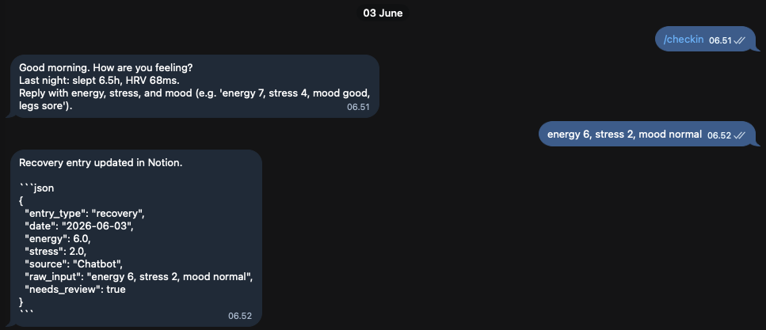
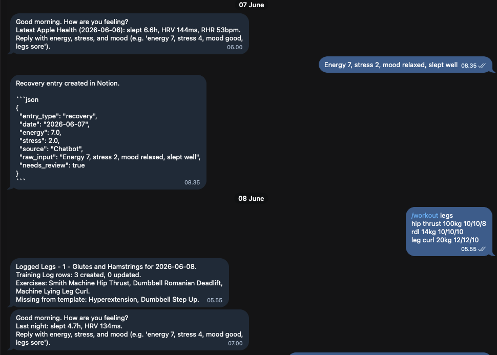
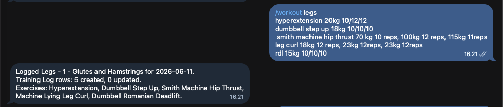

# Telegram Chatbot Evolution

These screenshots document how the Telegram interface has evolved from a simple local-LLM conversation surface into a structured logging workflow for recovery, health context, and training.

The chatbot is intentionally lightweight: Telegram is the daily capture layer, while Notion and local project code handle persistence, parsing, and later review.

## 1. Free-Form Recovery Coaching

Early versions behaved like a conversational coach. The bot could respond to natural-language questions with broad recovery guidance, but the interaction was mostly advisory rather than structured.



This stage validated the value of a low-friction chat interface: it was easy to ask a question in the same place where daily logging would eventually happen.

## 2. Personal Context Notes

The next step was using Telegram as a place to capture body-context observations that might matter later, such as soreness, sleep position, or shoulder tightness.



At this point the bot was still conversational, but the desired direction was becoming clearer: subjective context should become structured data, not disappear into a chat history.

## 3. Structured Recovery Logging

The recovery workflow then shifted toward parsing short daily check-ins into structured fields: sleep, energy, stress, mood, notes, source, and review status.



This made the chatbot part of the data spine. Instead of only generating advice, it could capture a daily recovery state and write it into the tracking system.

## 4. Morning Check-Ins With Health Context

Scheduled morning prompts added Apple Health context such as sleep, HRV, and resting heart rate. The user reply could then update the same daily recovery record.



This moved the interaction from manual logging toward a guided review loop: the bot brings forward known signals, then asks for the subjective state that wearables cannot fully infer.

## 5. Recovery Plus Training Capture

Later iterations added workout logging through Telegram alongside recovery check-ins. This connected subjective readiness and training execution in the same capture surface.



The bot can now support both sides of the feedback loop:

- Recovery state before training
- Training work performed
- Missing or ambiguous template items
- Notion persistence for later review

## 6. Workout Summary Feedback

The workout logging path returns a concise confirmation after parsing the training message, including the training log count and exercises detected.



This is still an early interface, but it shows the direction of the system: quick capture first, structured records underneath, and increasingly useful feedback as the personal dataset grows.

## 7. Flexible Training Plan Logging

The workout logger now supports more realistic training-plan updates instead of requiring every workout to be typed from scratch. Recent parser work added:

- copy-forward logging from stable weekly workout templates
- per-set weights
- qualitative loads such as bodyweight or machine-weight descriptions
- workout-level and exercise-level notes
- month-name dates for delayed logging

This keeps Telegram useful for real gym behavior: the user can capture what changed, attach notes, and avoid rebuilding the whole training log manually.

## Product Direction

The Telegram chatbot is not the final product surface. It is the smallest useful interface for real daily data capture.

The evolution so far:

```text
free-form advice
-> personal context notes
-> structured recovery logs
-> Apple Health-aware prompts
-> Telegram workout logging
-> copy-forward and flexible workout updates
-> future review and coaching intelligence
```

The important shift is from "chatbot as advice generator" to "chatbot as a capture and feedback layer for a personalized human-performance model."
