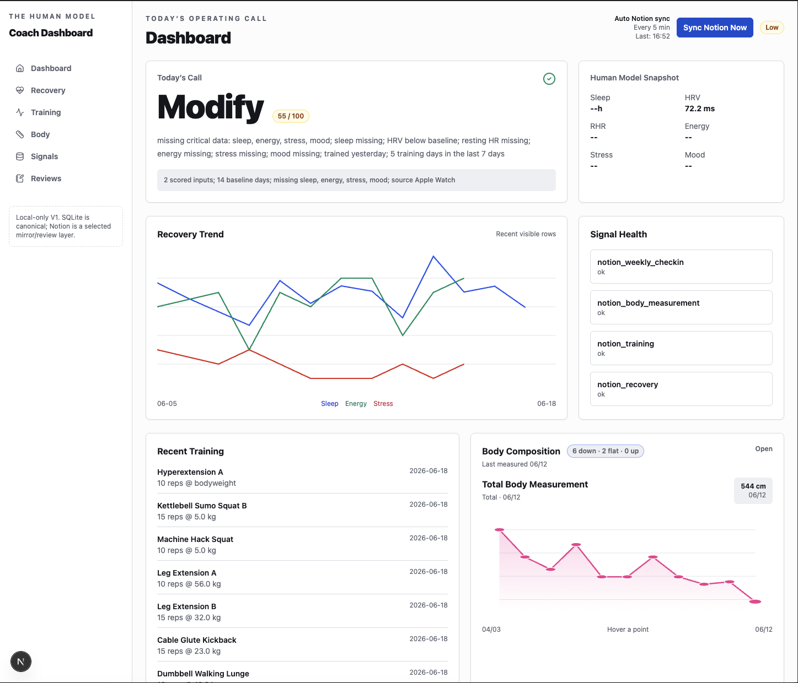
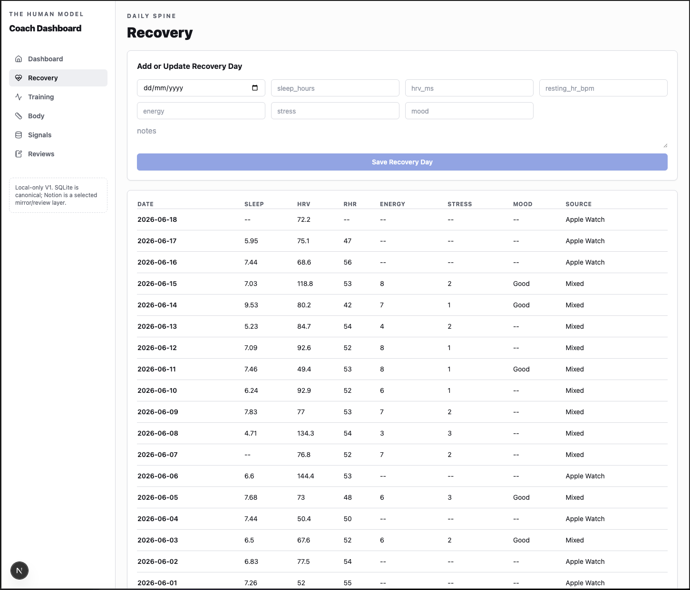
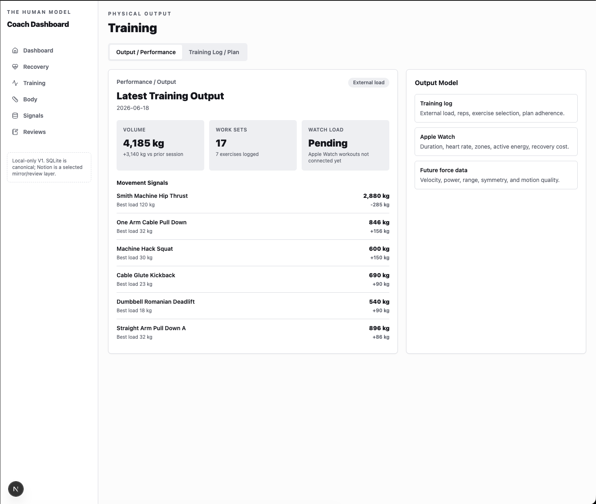
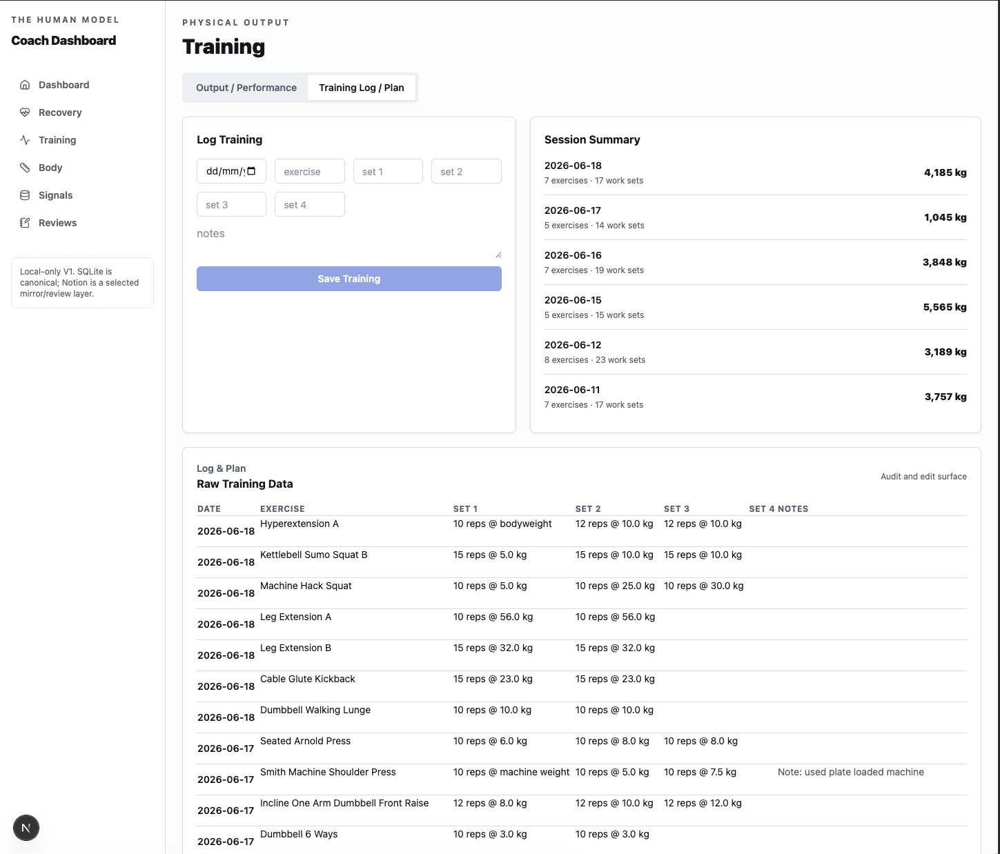
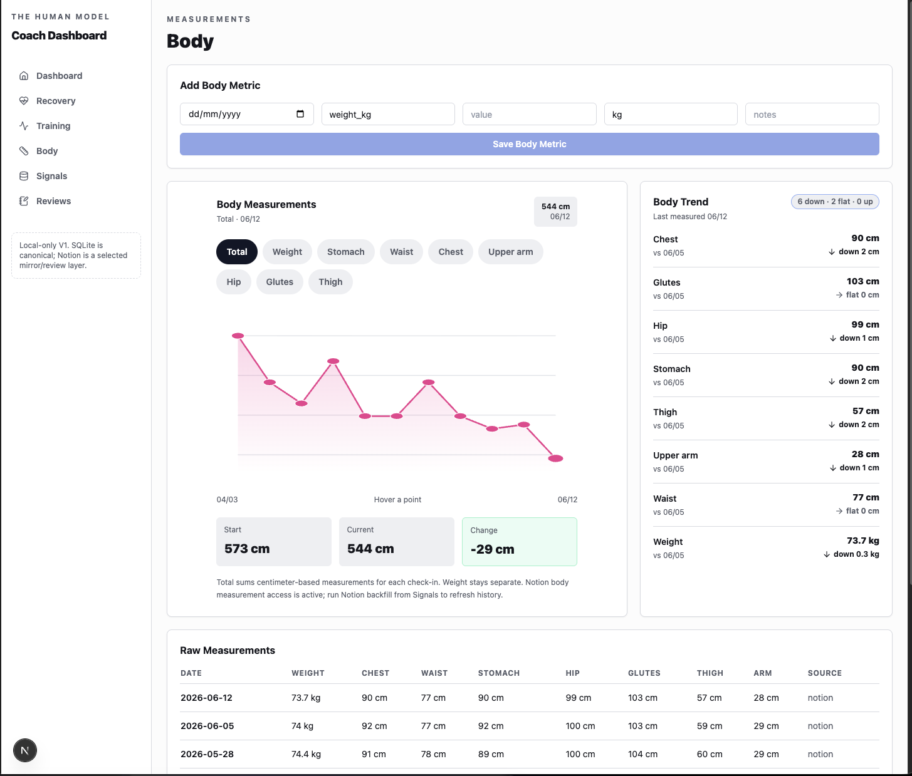
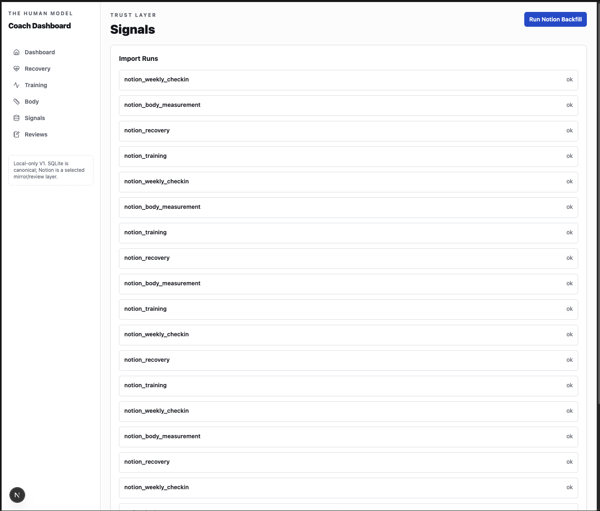
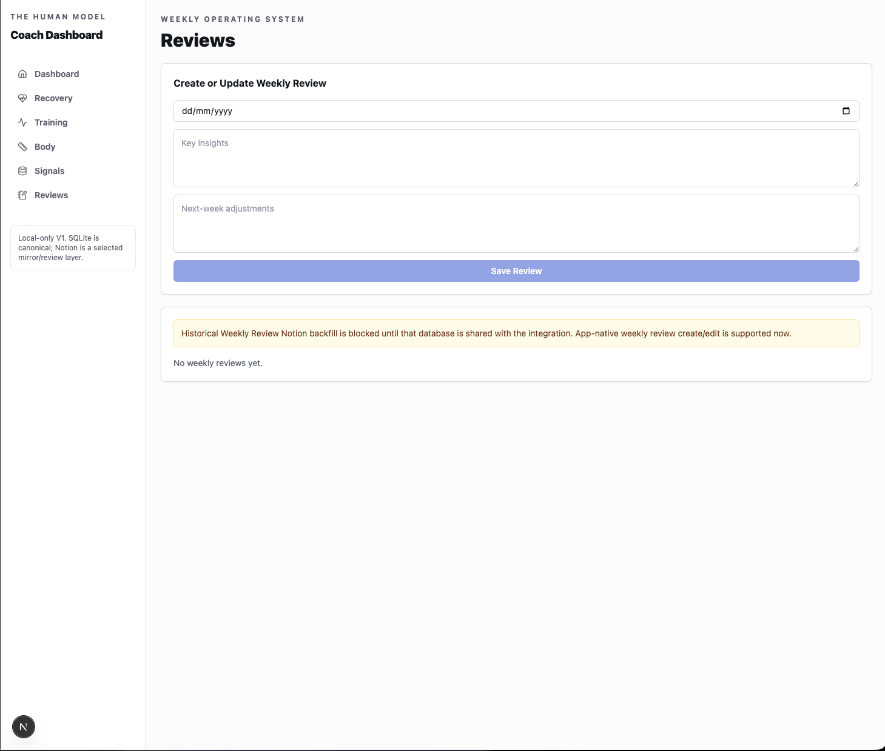

# Coach Dashboard V1

Coach Dashboard V1 is the local review surface for The Human Model. It turns the recovery, training, body, review, and import pipelines into a single coach-style operating view.

This is not presented as a finished SaaS product. It is a local-first working dashboard built to make the data spine easier to audit, review, and improve.

## What It Shows

Implemented:

- Daily operating call with readiness context and missing-data flags
- Recovery history from Apple Watch metrics and subjective check-ins
- Training output summaries from logged sessions
- Body measurement trends from imported and app-entered records
- Body-measurement progress charts
- Apple Watch workout and active-energy context for Readiness vs Actual review
- Signal health for Notion sync and backfill jobs
- Weekly review creation/edit surface

Active integration work:

- Structured training-session summaries, weekly volume, review flags, and progression signals
- Training-plan import and richer session-detail panels
- Dashboard V2 payloads for lift calls, evidence stacks, risk/progression, and weekly training status

## Implementation Context

The dashboard lives in the foundation repo and uses:

- FastAPI backend
- SQLite canonical local store
- Next.js frontend
- Notion as a selected mirror and review layer
- Apple Health, Telegram, and OCR-derived records as upstream context

The V1 design priority is operational usefulness: one place to see the current call, the evidence behind it, and whether the data feeding the system is trustworthy. Bridget remains the daily delivery surface; the dashboard is the deeper review and audit layer.

Recent committed work adds Apple Watch workout and active-energy import plus a Readiness vs Actual review. Active integration work is making the dashboard less like a raw table viewer and more like a coaching data spine, with structured lifting tables, training-plan import, dashboard V2 payloads, and richer session-detail panels still being hardened.

## Screenshots

### Overview

### Recovery

### Training Output

### Training Log

### Body

### Signals

### Reviews

## Current Limits

- The dashboard is still local-only.
- The readiness call is a V1 interpretation layer, not a validated predictive model.
- Structured lifting/session normalization is still in active integration.
- Some Notion backfill paths depend on database sharing and integration access.
- Private health and training data remain outside this public repository.
